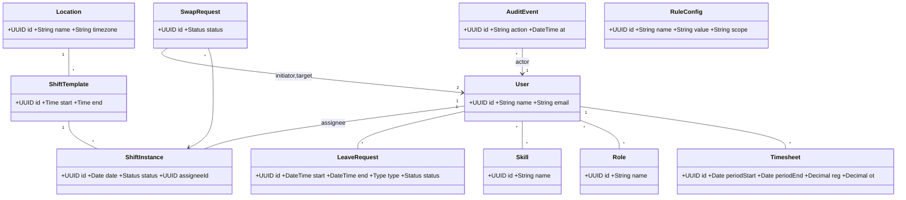

nice, let’s lock down Stage 2 for your ShiftCraft project. Below is a complete, ready to submit write-up you can paste into your doc or pdf. It covers full functional and non-functional requirements, a cohesive use case model, and explicit objects, classes, and relationships. I also included CRC cards and text UML so you have optional extras.

# Stage 2. Capstone Project Use Cases

System: ShiftCraft — staff scheduling and time management for small clinics and labs

## 1. System overview

ShiftCraft helps small healthcare teams plan legal rosters, handle swap and leave requests, and produce auditable timesheets for payroll. Primary roles are Manager and Staff. Secondary roles are Finance and Admin.

## 2. Stakeholders and actors

Actors
• Staff: clinical or support staff who receive shift assignments, request leaves, and propose swaps
• Manager: plans schedules, approves swaps and leaves, publishes rosters
• Finance: exports and reviews timesheets
• Admin: configures master data, skills, and rules
• External Mailer or Push Service: receives notification events

## 3. Functional requirements

Legend FR-X with short title

Authentication and access
FR-1 User registration with role assignment by Admin
FR-2 Login with JWT
FR-3 Role based access control for Manager, Staff, Finance, Admin

Master data and rules
FR-4 Manage Skills list create read update delete
FR-5 Manage Roles and role to permission mappings
FR-6 Configure scheduling rules minimum rest hours, max weekly hours, required skills per shift template, location constraints
FR-7 Manage locations and shift templates start time, end time, role, required skills, location

Scheduling
FR-8 Create weekly schedule draft from templates
FR-9 Assign staff to draft shifts with real time rule validation
FR-10 Publish schedule to make it visible and immutable except via controlled changes
FR-11 View schedules by week, staff, or location

Leave and availability
FR-12 Staff submit leave requests with type vacation sick unpaid
FR-13 Manager approves or rejects leave requests with reason
FR-14 Approved leave auto blocks conflicting assignments
FR-15 Staff set personal availability preferences soft constraints

Swaps and adjustments
FR-16 Staff propose swap for an assigned shift to a target staff
FR-17 Target staff accepts or declines
FR-18 Manager final approval with automatic revalidation of rules
FR-19 Track full audit of swap lifecycle

Timesheets and payroll
FR-20 Generate timesheets per staff and pay period including regular hours overtime and allowances
FR-21 Export timesheets as CSV
FR-22 Finance marks export batches as reviewed

Notifications
FR-23 Notify Staff on new assignment, swap proposal, approval or rejection
FR-24 Notify Manager on pending approvals
FR-25 Notification delivery via email webhook

Audit and reporting
FR-26 Record AuditEvent for changes and approvals
FR-27 View audit log by entity or date range

Ops and administration
FR-28 Seed sample data for demo environments
FR-29 Health endpoints for liveness and readiness

## 4. Non-functional requirements

Security and privacy
NFR-1 JWT based auth with rotating signing key
NFR-2 Enforce least privilege per role
NFR-3 Encrypt secrets in transit TLS and at rest via DB native encryption where available
NFR-4 Audit trail is append only and immutable to non Admin roles

Reliability and availability
NFR-5 Zero data loss for committed transactions
NFR-6 Graceful recovery on service restart with idempotent message delivery to the notifier

Performance and scalability
NFR-7 Schedule view renders under 500 ms P95 for a week with up to 200 staff
NFR-8 Timesheet generation completes under 10 s for a team of up to 200 staff per period

Usability
NFR-9 Calendar supports week and person views and keyboard navigation
NFR-10 Validation messages are human readable showing which rule failed

Compliance and retention
NFR-11 Keep audit records for minimum 3 years configurable
NFR-12 Time zone aware storage and presentation ISO 8601 with clinic time zone context

Observability and testability
NFR-13 Structured logs with correlation ids
NFR-14 80 percent line coverage in core business rules
NFR-15 Testcontainers based integration tests for DB interactions

## 5. Use case model

### 5.1 Use case list mapped to actors

UC-01 Register user Admin
UC-02 Login User
UC-03 Manage skills Admin
UC-04 Configure scheduling rules Admin
UC-05 Create weekly schedule draft Manager
UC-06 Assign staff to shifts Manager
UC-07 Publish schedule Manager
UC-08 View my schedule Staff
UC-09 Request leave Staff
UC-10 Approve or reject leave Manager
UC-11 Propose swap Staff initiator
UC-12 Respond to swap Staff target
UC-13 Approve swap Manager
UC-14 Generate timesheets Finance or Manager
UC-15 Export timesheets Finance
UC-16 View audit log Admin or Manager
UC-17 Receive notifications External Mailer or Push

### 5.2 Detailed use case specifications

#### UC-05 Create weekly schedule draft

Primary actor Manager
Preconditions Manager authenticated, rules and templates exist
Main flow
1 Manager selects week and location
2 System loads shift templates and known leaves for that period
3 Manager creates draft schedule auto populating from templates
4 System validates rules and flags conflicts
5 Manager saves draft
Postconditions Draft schedule exists with zero or more conflicts flagged
Alternate flows
A1 No templates configured System shows empty draft and suggests creating templates FR-7
A2 Conflicts detected Conflicts listed on screen and saved as warnings FR-6

#### UC-06 Assign staff to shifts

Primary actor Manager
Preconditions Draft schedule created, staff exist
Main flow
1 Manager selects a draft shift
2 Manager searches staff by role and skill
3 System filters eligible staff and checks leaves and availability
4 Manager assigns staff
5 System runs rule validation min rest, weekly max hours, required skills
6 On pass system records assignment and marks shift as assigned
Postconditions Shift assigned and view shows updated roster
Alternate flows
A1 Validation fails System shows specific failed rule and prevents assignment FR-6
A2 Staff double booked System suggests other candidates

#### UC-07 Publish schedule

Primary actor Manager
Preconditions All hard conflicts resolved
Main flow
1 Manager clicks Publish for the week
2 System locks assignments and emits notifications to Staff FR-23
Postconditions Schedule state published, further changes require swap or manager edit with audit

#### UC-09 Request leave

Primary actor Staff
Preconditions Staff authenticated
Main flow
1 Staff opens Leave page and selects dates, type, comment
2 System checks overlap with published shifts and warns if conflicts
3 Staff submits request
4 System records LeaveRequest status pending and notifies Manager FR-24
Postconditions Pending leave created
Alternate flows
A1 Dates touch published shifts Warning shown but submission allowed; final decision by Manager
A2 Validation failure invalid range System shows error

#### UC-10 Approve or reject leave

Primary actor Manager
Preconditions Pending leave exists
Main flow
1 Manager opens Pending approvals
2 Manager reviews request details and conflicts
3 Manager approves or rejects with reason
4 On approval system updates status approved, blocks conflicting future assignments, and notifies Staff FR-23
Postconditions Leave finalized and schedule recalculated where needed

#### UC-11 Propose swap

Primary actor Staff initiator
Preconditions Staff has an assigned shift in future and schedule is published
Main flow
1 Staff selects a shift to swap and a target staff
2 System verifies target eligibility role skill rest rules
3 System creates SwapRequest status proposed and notifies target FR-23
Postconditions Swap awaiting target response
Alternate flows
A1 Target not eligible System disallows and explains failed rule
A2 Multiple candidates Initiator can select any eligible peer

#### UC-12 Respond to swap

Primary actor Staff target
Preconditions Swap in proposed state
Main flow
1 Target reviews proposal
2 Target accepts or declines
3 On accept system advances status to awaiting manager approval and notifies Manager FR-24
Postconditions Awaiting approval

#### UC-13 Approve swap

Primary actor Manager
Preconditions Swap accepted by target
Main flow
1 Manager reviews swap and any downstream effects
2 System revalidates rules on resulting schedule
3 Manager approves
4 System swaps assignees, updates audit log, and notifies both Staff
Postconditions Schedule updated with audit entry

#### UC-14 Generate timesheets

Primary actor Finance or Manager
Preconditions Pay period boundaries defined
Main flow
1 Actor selects period and optional staff filter
2 System aggregates assignments and applied leaves
3 System calculates regular and overtime hours per rules
4 System stores Timesheet and shows summary
Postconditions Timesheets available for export

#### UC-15 Export timesheets

Primary actor Finance
Preconditions Generated timesheets exist
Main flow
1 Finance selects period and clicks Export
2 System produces CSV and marks batch reviewed
Postconditions CSV downloaded and review record stored

### 5.3 Use case to requirement traceability matrix

UC-05 FR-8 FR-6
UC-06 FR-9 FR-6
UC-07 FR-10 FR-23
UC-09 FR-12
UC-10 FR-13 FR-14
UC-11 FR-16
UC-12 FR-17
UC-13 FR-18 FR-26
UC-14 FR-20
UC-15 FR-21 FR-22

## 6. Objects, classes, and relationships

### 6.1 Key domain classes with attributes

User id, name, email, roles, skills
Role id, name, permissions
Skill id, name
Location id, name, timezone
ShiftTemplate id, roleId, requiredSkillIds, startTime, endTime, locationId
ShiftInstance id, templateId, date, assigneeId optional, status Draft Assigned Published Cancelled
LeaveRequest id, userId, start, end, type, status Pending Approved Rejected, managerComment
SwapRequest id, fromShiftId, initiatorId, targetUserId, status Proposed Accepted AwaitingApproval Approved Rejected, timeline events
Timesheet id, userId, periodStart, periodEnd, hoursRegular, hoursOvertime, allowances
AuditEvent id, actorId, action, entityType, entityId, timestamp, details
RuleConfig id, name, value, scope clinic or role

### 6.2 Relationships and multiplicities

User 1..\* has Role many to many
User 0..\* has Skill many to many
Location 1..\* has ShiftTemplate 1..\*
ShiftTemplate 1 creates many ShiftInstance
ShiftInstance 0..1 assigned to User as assignee
User 0..\* has LeaveRequest 0..\*
SwapRequest references one ShiftInstance and two Users initiator and target
Timesheet 1 belongs to User and covers many ShiftInstances
AuditEvent references one actor User and one target entity by id
RuleConfig applies to Location, Role, or global using scope

### 6.3 Optional class diagram in text Mermaid

You can paste this into any Mermaid renderer if you want a picture.

## 7. CRC cards optional

User
Responsibilities authenticate, manage profile, request leaves, propose accept swaps
Collaborators Role, Skill, ShiftInstance, LeaveRequest, SwapRequest

Manager role specializes User
Responsibilities plan schedule, publish, approve leaves and swaps
Collaborators ShiftTemplate, ShiftInstance, LeaveRequest, SwapRequest, AuditEvent

ShiftTemplate
Responsibilities define reusable time blocks and role skill requirements
Collaborators Location, Skill

ShiftInstance
Responsibilities represent a concrete shift on a date, hold assignment and status
Collaborators User assignee, ShiftTemplate, AuditEvent

LeaveRequest
Responsibilities represent time off with lifecycle and conflict checks
Collaborators User, ShiftInstance validation

SwapRequest
Responsibilities orchestrate initiator target manager approval
Collaborators User initiator target, ShiftInstance, AuditEvent

Timesheet
Responsibilities aggregate hours per period and compute overtime
Collaborators User, ShiftInstance, LeaveRequest

AuditEvent
Responsibilities immutable record of important actions
Collaborators User actor, various target entities

RuleConfig
Responsibilities store clinic rules used by validators
Collaborators ShiftInstance, ShiftTemplate, validation services

## 8. Acceptance criteria examples

AC-Schedule validation
Given a manager assigns a staff member who worked a late shift yesterday
When the assignment would violate minimum rest hours
Then the system blocks the assignment and shows the exact rule that failed

AC-Swap approval
Given a swap accepted by target staff
When manager approves
Then assignees are swapped, audit event recorded, and both staff receive notifications

AC-Timesheet
Given a published schedule and approved leaves in a period
When a timesheet is generated
Then hours are computed with overtime where weekly threshold exceeded and a CSV export is available

## 9. Glossary

Assignment shift instance with an assignee
Draft schedule schedule not yet published
Published schedule schedule visible to all and change controlled
Eligibility ability to take a shift based on skills, role, leaves, and rules

## 10. Submission checklist mapped to the rubric

• Functional and non-functional requirements fully described sections 3 and 4
• Use cases designed and based on requirements sections 5 and 8
• Objects, classes, and relationships identified sections 6 and 7
• Document ready for upload

## 11. Merge request link placeholder

Paste your MR link here once you push docs and skeleton code.
Example
https colon slash slash your-git-host slash shiftcraft slash merge\_requests slash 1

---

If you want this as a polished pdf or docx with a cover page, say the word and I will generate the file for you immediately.

