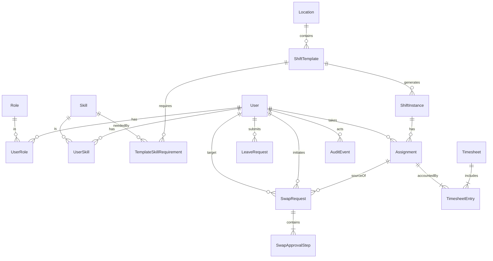

# ShiftCraft - Stage 3 Database Design

System: ShiftCraft — staff scheduling and time management for small clinics and labs

## Step 1. Identify entities and their types

### Key (strong) entities

1. User
2. Role
3. Skill
4. Location
5. ShiftTemplate
6. SwapRequest
7. LeaveRequest
8. Timesheet
9. AuditEvent
10. RuleConfig

### Weak entities

1. ShiftInstance
   Depends on ShiftTemplate and Date. Natural identifying relationship is (template\_id, shift\_date). You may still keep a surrogate id for convenience, but model the dependency in the ERD.
2. SwapApprovalStep
   Depends on SwapRequest with weak key step\_no to preserve the approval timeline.

### Associative entities

1. UserRole relates User ↔ Role
2. UserSkill relates User ↔ Skill
3. TemplateSkillRequirement relates ShiftTemplate ↔ Skill
4. Assignment relates User ↔ ShiftInstance
5. TimesheetEntry relates Timesheet ↔ Assignment

That gives you 15 unique entities with clear types and names.

## Step 2. Identify relationships

I show the relationship verb, direction, and business meaning.

1. User has Role through UserRole
2. User has Skill through UserSkill
3. Location contains ShiftTemplate
4. ShiftTemplate requires Skill through TemplateSkillRequirement
5. ShiftTemplate generates ShiftInstance
6. ShiftInstance is assigned to User through Assignment
7. User submits LeaveRequest
8. Manager approves LeaveRequest recorded in AuditEvent
9. User initiates SwapRequest for a specific Assignment
10. SwapRequest contains SwapApprovalStep
11. Manager approves SwapRequest recorded in AuditEvent and results in reassigned Assignments
12. Timesheet aggregates TimesheetEntry
13. TimesheetEntry references Assignment
14. RuleConfig applies to Location or Role or Global scope
15. System records AuditEvent for any state change and references the actor User

## Step 3. Cardinality and ordinality

Notation min..max. Optionality explained after each.

1. User 1..\* ↔ 1..\* Role via UserRole
   UserRole has PK (user\_id, role\_id). Both sides optional at creation, but a Staff user must have at least one role for access.

2. User 0..\* ↔ 1..\* Skill via UserSkill
   Optional for both.

3. Location 1..\* → 0..\* ShiftTemplate
   Each template belongs to exactly one location. A location can exist before templates.

4. ShiftTemplate 1 → 0..\* ShiftInstance
   Template can exist without generated instances. A shift instance must have a template. Optionality: ShiftInstance min is zero.

5. ShiftTemplate 0..\* ↔ 1..\* Skill via TemplateSkillRequirement
   Optional to allow simple roles without skills.

6. ShiftInstance 0..1 ↔ 0..\* User via Assignment
   Most clinics have one person per shift instance. Allow 0..\* Users through Assignment for edge cases like overlapping handover or shadowing. If you need strict one assignee, set a unique index on Assignment per shift\_instance\_id and status = active.

7. User 0..\* → 0..\* LeaveRequest
   A request belongs to one user; a user can have many requests, possibly zero.

8. User 0..\* → 0..\* SwapRequest
   An initiator creates many swap requests. A swap references exactly one source Assignment and one target User.

9. SwapRequest 1 → 1..\* SwapApprovalStep
   At least one step exists after creation. step\_no starts at 1.

10. Timesheet 1 → 1..\* TimesheetEntry
    A timesheet is not empty. Each entry references exactly one Assignment.

11. Assignment 1 → 0..1 TimesheetEntry
    At most one entry per assignment per period.

12. User 1 → 0..\* AuditEvent
    Events always have an actor. System-generated events can use a special System user.

13. RuleConfig 0..\* → 0..\* Location or Role
    Rule can be global or scoped. Enforce scope by nullable foreign keys with a scope\_type discriminator.

## Step 4. Attributes per entity and their types

Legend
PK key attribute, WK weak key, D derived, MV multivalued

### User \[key]

id PK, email unique, first\_name, last\_name, status, created\_at
D full\_name = first\_name || ' ' || last\_name
MV phones represented as child entity UserPhone if you want a concrete MV example: id PK, user\_id FK, phone\_number

### Role \[key]

id PK, name unique

### Skill \[key]

id PK, name unique

### UserRole \[associative]

user\_id PK,FK → User, role\_id PK,FK → Role, granted\_at

### UserSkill \[associative]

user\_id PK,FK → User, skill\_id PK,FK → Skill, level optional enum beginner intermediate expert

### Location \[key]

id PK, name, timezone, address\_line, city

### ShiftTemplate \[key]

id PK, location\_id FK, role\_id FK, start\_time, end\_time, break\_minutes, name, recurrence weekly mask if you later auto generate

### TemplateSkillRequirement \[associative]

template\_id PK,FK → ShiftTemplate, skill\_id PK,FK → Skill

### ShiftInstance \[weak]

id PK surrogate, template\_id FK, shift\_date WK component, status enum DRAFT PUBLISHED CANCELLED
Business identifier can be (template\_id, shift\_date). Keep unique(template\_id, shift\_date).

### Assignment \[associative]

id PK, shift\_instance\_id FK, user\_id FK, status enum ACTIVE CANCELLED SWAPPED, assigned\_at, assigned\_by FK → User

### LeaveRequest \[key]

id PK, user\_id FK, type enum VACATION SICK UNPAID, start\_at, end\_at, status enum PENDING APPROVED REJECTED, manager\_comment, created\_at, decided\_at

### SwapRequest \[key]

id PK, source\_assignment\_id FK, initiator\_id FK → User, target\_user\_id FK → User, status enum PROPOSED ACCEPTED AWAITING\_APPROVAL APPROVED REJECTED, created\_at, decided\_at

### SwapApprovalStep \[weak]

swap\_request\_id PK,FK → SwapRequest, step\_no WK, actor\_id FK → User, decision enum PROPOSE ACCEPT DECLINE APPROVE REJECT, comment, decided\_at

### Timesheet \[key]

id PK, user\_id FK, period\_start, period\_end, created\_at
D total\_hours computed from entries
D overtime\_hours computed via rules

### TimesheetEntry \[associative]

id PK, timesheet\_id FK, assignment\_id FK unique per timesheet, hours\_worked, overtime\_hours

### AuditEvent \[key]

id PK, actor\_id FK → User, entity\_type, entity\_id, action, payload\_json, created\_at

### RuleConfig \[key]

id PK, scope enum GLOBAL LOCATION ROLE, location\_id nullable FK, role\_id nullable FK, name, value\_text
Examples: MIN\_REST\_HOURS=12, WEEKLY\_MAX\_HOURS=48

## ER diagram (Mermaid ER)

You can paste this into any Mermaid renderer.



Cardinality note
\| is 1, } is many, o is zero. For example Timesheet ||--|{ TimesheetEntry means one Timesheet to one or many entries.

## Relational schema starter (PostgreSQL DDL)

This is ready to drop into a Flyway V1\_\_baseline.sql. It encodes keys, weak keys, associative tables, and important unique and check constraints.

```sql
create type shift_status as enum ('DRAFT','PUBLISHED','CANCELLED');
create type assign_status as enum ('ACTIVE','CANCELLED','SWAPPED');
create type leave_type as enum ('VACATION','SICK','UNPAID');
create type decision as enum ('PROPOSE','ACCEPT','DECLINE','APPROVE','REJECT');
create type request_status as enum ('PROPOSED','ACCEPTED','AWAITING_APPROVAL','APPROVED','REJECTED');

create table users (
  id uuid primary key,
  email text not null unique,
  first_name text not null,
  last_name text not null,
  status text not null default 'ACTIVE',
  created_at timestamptz not null default now()
);

create table roles (
  id uuid primary key,
  name text not null unique
);

create table skills (
  id uuid primary key,
  name text not null unique
);

create table user_roles (
  user_id uuid references users(id) on delete cascade,
  role_id uuid references roles(id) on delete restrict,
  granted_at timestamptz not null default now(),
  primary key (user_id, role_id)
);

create table user_skills (
  user_id uuid references users(id) on delete cascade,
  skill_id uuid references skills(id) on delete restrict,
  level text,
  primary key (user_id, skill_id)
);

create table locations (
  id uuid primary key,
  name text not null,
  timezone text not null,
  address_line text,
  city text
);

create table shift_templates (
  id uuid primary key,
  location_id uuid not null references locations(id) on delete restrict,
  role_id uuid not null references roles(id) on delete restrict,
  name text not null,
  start_time time not null,
  end_time time not null,
  break_minutes int not null default 0,
  recurrence int
);

create table template_skill_requirements (
  template_id uuid references shift_templates(id) on delete cascade,
  skill_id uuid references skills(id) on delete restrict,
  primary key (template_id, skill_id)
);

create table shift_instances (
  id uuid primary key,
  template_id uuid not null references shift_templates(id) on delete cascade,
  shift_date date not null,
  status shift_status not null default 'DRAFT',
  unique (template_id, shift_date)
);

create table assignments (
  id uuid primary key,
  shift_instance_id uuid not null references shift_instances(id) on delete cascade,
  user_id uuid not null references users(id) on delete restrict,
  status assign_status not null default 'ACTIVE',
  assigned_at timestamptz not null default now(),
  assigned_by uuid references users(id)
  -- if you want exactly one active assignee per shift:
  -- , unique (shift_instance_id) where (status = 'ACTIVE')
);

create table leave_requests (
  id uuid primary key,
  user_id uuid not null references users(id) on delete restrict,
  type leave_type not null,
  start_at timestamptz not null,
  end_at timestamptz not null,
  status text not null default 'PENDING',
  manager_comment text,
  created_at timestamptz not null default now(),
  decided_at timestamptz
);

create table swap_requests (
  id uuid primary key,
  source_assignment_id uuid not null references assignments(id) on delete cascade,
  initiator_id uuid not null references users(id) on delete restrict,
  target_user_id uuid not null references users(id) on delete restrict,
  status request_status not null default 'PROPOSED',
  created_at timestamptz not null default now(),
  decided_at timestamptz
);

create table swap_approval_steps (
  swap_request_id uuid not null references swap_requests(id) on delete cascade,
  step_no int not null,
  actor_id uuid not null references users(id) on delete restrict,
  decision decision not null,
  comment text,
  decided_at timestamptz not null default now(),
  primary key (swap_request_id, step_no)
);

create table timesheets (
  id uuid primary key,
  user_id uuid not null references users(id) on delete restrict,
  period_start date not null,
  period_end date not null,
  created_at timestamptz not null default now(),
  unique(user_id, period_start, period_end)
);

create table timesheet_entries (
  id uuid primary key,
  timesheet_id uuid not null references timesheets(id) on delete cascade,
  assignment_id uuid not null references assignments(id) on delete restrict,
  hours_worked numeric(5,2) not null,
  overtime_hours numeric(5,2) not null default 0,
  unique(timesheet_id, assignment_id)
);

create table audit_events (
  id uuid primary key,
  actor_id uuid not null references users(id) on delete set null,
  entity_type text not null,
  entity_id uuid not null,
  action text not null,
  payload_json jsonb not null default '{}',
  created_at timestamptz not null default now()
);

create table rule_configs (
  id uuid primary key,
  scope text not null check (scope in ('GLOBAL','LOCATION','ROLE')),
  location_id uuid references locations(id) on delete cascade,
  role_id uuid references roles(id) on delete cascade,
  name text not null,
  value_text text not null
);
```

### Derived attributes as views

Keep derived data consistent and explain it to the reviewer.

```sql
create view v_timesheet_totals as
select t.id as timesheet_id,
       sum(e.hours_worked) as total_hours,
       sum(e.overtime_hours) as overtime_hours
from timesheet_entries e
join timesheets t on t.id = e.timesheet_id
group by t.id;
```

### Multivalued attributes

Skills for a user are multivalued and normalized via UserSkill. If you want a second clear MV example, add UserPhone:

```sql
create table user_phones (
  id uuid primary key,
  user_id uuid not null references users(id) on delete cascade,
  phone_number text not null,
  unique(user_id, phone_number)
);
```

## Notes for your ERD diagram

• Mark ShiftInstance as a weak entity with a partial key shift\_date, owned by ShiftTemplate
• Mark SwapApprovalStep as a weak entity owned by SwapRequest with WK step\_no
• Label associative entities with diamond or note, depending on your diagramming tool
• Show optionality with 0..1 and 0..\* near the optional side

## What to put in the merge request

1. docs/erd/shiftcraft-erd.mmd with the Mermaid ER from above
2. db/migration/V1\_\_baseline.sql with the DDL
3. docs/erd/readme.md explaining key, weak, and associative choices in two paragraphs
4. A screenshot or exported PDF of the ERD from your tool

## Submission text you can paste

Title
Stage 3. Capstone Project Database Layer Design

Summary
I identified strong, weak, and associative entities for ShiftCraft and produced an ER diagram with correct relationships, cardinalities, and optionalities. The schema distinguishes business identifiers and technical surrogate keys, models multivalued attributes through associative tables, and keeps derived attributes as views for consistency.

Entities and types
Key entities: User, Role, Skill, Location, ShiftTemplate, SwapRequest, LeaveRequest, Timesheet, AuditEvent, RuleConfig
Weak entities: ShiftInstance identified by (template\_id, shift\_date), SwapApprovalStep identified by (swap\_request\_id, step\_no)
Associative entities: UserRole, UserSkill, TemplateSkillRequirement, Assignment, TimesheetEntry

Relationships and cardinalities
Detailed in the ERD. Examples: ShiftTemplate 1 to many ShiftInstance, Assignment relates User many to many ShiftInstance with optionality zero to many on both sides, Timesheet 1 to many TimesheetEntry

Attributes
Keys, weak keys, derived totals, and multivalued skills are specified per entity. Derived totals are exposed as a view v\_timesheet\_totals. Multivalued attributes are normalized into UserSkill and optional UserPhone.

Merge request link <your MR link here>

If you want, I can also generate a neatly formatted PDF from this content with the Mermaid diagram embedded.

